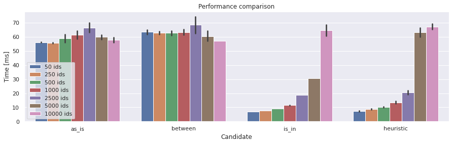

Performance
===========
Compare the best possible or average performance using multiple candidates and data sets.

   Output from a multivariate performance testing.

.. warning::
    By default, members of the :mod:`rics.performance` reports averages of all runs (repetitions), as opposed to the
    built-in :py:mod:`timeit` module which reports only the best result (in non-verbose mode).

.. toctree::
   :hidden:

   SQL select statements <../notebooks/in-vs-between/In-vs-Between>
