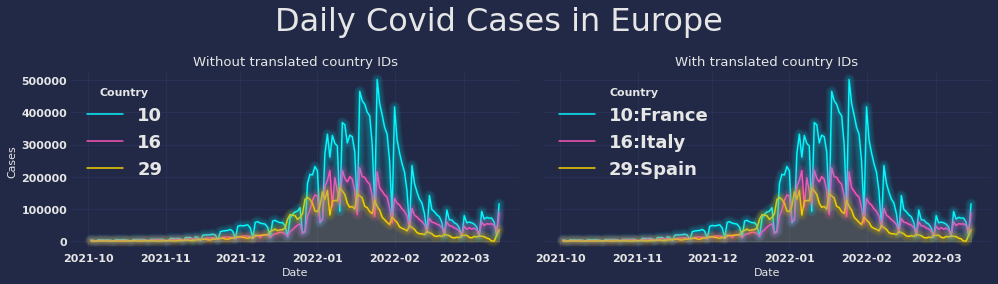

ID Translation
==============

Turn meaningless IDs into human-readable labels.

   Total number of `Covid cases`_ cases per day. IDs have been translated using the standard **id:name**-format.

.. toctree::
   :hidden:

   dvdrental
   ../notebooks/pickle-translation/PickleFetcher
   ../notebooks/sql-translation/SqlFetcher
   ../notebooks/translation-primer/api
   ../notebooks/translation-primer/config

.. _Covid cases:
    https://www.ecdc.europa.eu/en/publications-data/download-todays-data-geographic-distribution-covid-19-cases-worldwide
