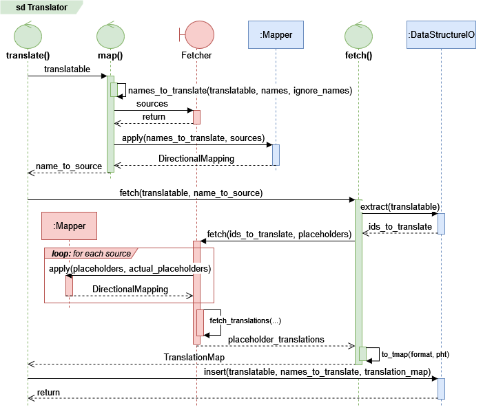
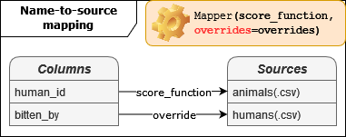
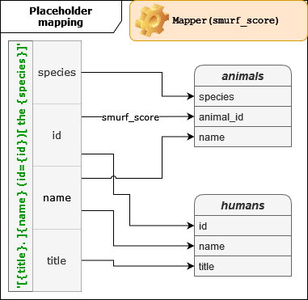

.. _translation-primer:

Translation primer
==================
The main entry point for translation tasks is the :class:`rics.translation.Translator` class. Translation relies heavily
on the :ref:`mapping <mapping-primer>` package suite.

This document will be dedicated to a toy example -- translating a `"Bite report"` from a misfortunate petting zoo -- in
order to demonstrate some key concepts. Each new component will be presented in the order in which they are used during
normal operation.

To keep things simple, we will keep everything in a single folder -- the current working directory -- for this example.
The file structure is as follows:

.. code-block:: bash

   . # current working directory
   ├── translation-primer.py
   ├── biting-victims-2019-05-11.csv
   ├── biting-victims-2019-05-11-translated.csv
   └── sources
       ├── animals.csv
       └── humans.csv

This example uses the API to construct the ``Translator`` instance, but the recommended way of creating instances are
:ref:`translator-config` files. Condensed versions for creating an equivalent ``Translator`` using the either the API or
TOML configuration is available in the :ref:`notebooks` section.

Call diagram
------------
Green objects are ``Translator`` member functions. Red entities belong to the
:attr:`~rics.translation.Translator.fetcher`. Blue indicates a task that is delegated to an object owned by the
``Translator``. The ``Translator`` either performs or coordinates the majority of tasks involved in translation. A
notable exception to this rule is the :ref:`placeholder mapping <fetcher-mapping-motivation>` subprocess, which is
handled by :meth:`AbstractFetcher.map_placeholders <rics.translation.fetching.AbstractFetcher.map_placeholders>`.

   Simplified call diagram for a translation task. Optional paths and error handling are omitted, as well as most
   details that are internal to the mapping and fetching processes.

A :class:`~rics.translation.fetching.PandasFetcher` is used in the example below, meaning that
:attr:`~rics.translation.fetching.PandasFetcher.sources` are resolved by searching for files in a given directory, and
actually :meth:`fetching translations <rics.translation.fetching.PandasFetcher.fetch_translations>` means reading files
in this directory.

Real applications typically use something like a :class:`SQL database <rics.translation.fetching.SqlFetcher>` instead as
the source. Underlying concepts remain the same, no matter how translation data is retrieved.

Translatable data
-----------------
We're translating a `"Bite report"` a misfortunate petting zoo, shown below.

.. csv-table:: biting-victims-2019-05-11.csv
   :file: examples/notebooks/translation-primer/biting-victims-2019-05-11.csv
   :header-rows: 1

The first columns indicates who was bitten (a human), the second who bit them (an animal). Since bites are a frequent
occurrence, the zoo uses integers IDs instead of plaintext for their bite reports to save space. The ``Translator``
doesn't work on files (see #154), so we'll use pandas to create a :class:`~pandas.DataFrame` that we can translate.

.. code-block:: python

   from pandas import DataFrame, read_csv
   bite_report: DataFrame = read_csv('biting-victims-2019-05-11.csv')

The ``Translator`` knows what a ``DataFrame`` is, and will assume that the columns are names to translate.

.. important::
   In the language of the ``Translator``, the bite report is a :attr:`~rics.translation.types.Translatable`. The columns
   ``'human_id'`` and ``'bitten_by'`` are the :attr:`names <rics.translation.types.NameType>` that must be
   :attr:`translated <rics.translation.Translator.translate>`.

Translation sources
-------------------
The zoo provides reference tables which allows us to make sense of the data. These tables are stored as regular CSV
files and contain some basic information about the humans and animals that are referenced in the (for now)
unintelligible bite report.

.. list-table:: Sources

    * - .. csv-table:: humans.csv
           :file: examples/notebooks/translation-primer/sources/humans.csv
           :header-rows: 1
           :stub-columns: 1

      - .. csv-table:: animals.csv
           :file: examples/notebooks/translation-primer/sources/animals.csv
           :header-rows: 1
           :stub-columns: 1

To access these tables, the ``Translator`` needs a :class:`~rics.translation.fetching.Fetcher` that can read and
interpret CSV files. The :class:`~rics.translation.fetching.PandasFetcher` is built to perform such tasks.

.. code-block:: python

   from rics.translation.fetching import PandasFetcher
   fetcher = PandasFetcher(
       read_function=read_csv,
       # Look for .csv-files in the 'sources' sub folder of the current working directory
       read_path_format='./sources/{}.csv'
   )

This fetcher will look for CSV files in the `sources` sub folder of the current working directory, using
:func:`pandas.read_csv` to deserialize them. Source names will be filenames without the `.csv`-suffix.

.. important::
   In the language of the ``Translator``, the CSV files ``'animals.csv'`` and ``'humans.csv'`` are translation
   :attr:`~rics.translation.Translator.sources`. All fetching is done through the
   :class:`~rics.translation.fetching.Fetcher` interface.

Name-to-source mapping
----------------------

The :mod:`rics.mapping` namespace modules are used to perform `name-to-source` mapping. By default, names and sources
must match exactly which is rarely the case in practice. In our case, there are two names that should be matched to one
source each.

* Mapping `human_id → humans`. Mappings like these are common and may be solved using the built-in
  :func:`~rics.mapping.heuristic_functions.like_database_table` heuristic.

  .. code-block:: python

     from rics.mapping import HeuristicScore
     score_function = HeuristicScore('equality', heuristics=['like_database_table'])

* Mapping `bitten_by → animals`. This is an impossible mapping without high-level understanding of the context. Using
  and `override` is the best solution in this case.

  .. code-block:: python

     overrides = {'bitten_by': 'animals'}

We're now ready to create the :class:`~rics.mapping.Mapper` instance.

.. code-block:: python

   from rics.mapping import Mapper
   mapper = Mapper(score_function, overrides=overrides)

.. important::

   In the language of the ``Mapper``, `names` become :attr:`values <rics.mapping.types.ValueType>` and the `sources` are
   referred to as the :attr:`candidates <rics.mapping.types.CandidateType>`. See the :ref:`mapping-primer` page for more
   information.

Translation format
------------------
We must now decide what we want our report to look like once it's translated. First, we note that the first two columns,
``'id'`` and ``'name'``, are the same for humans and animals. The ``'humans'`` source also has a unique ``'title'``
column (or `placeholder`). The ``'animals'`` source has a unique ``'species'`` placeholder.

We would like the translations to include as much information as possible, and as such we will use a flexible
:class:`~rics.translation.offline.Format` that includes two
:attr:`optional <rics.translation.offline.Format.optional_placeholders>` placeholders.

.. code-block:: python

   translation_format = '[{title}. ]{name} (id={id})[ the {species}]'

The use of optional blocks (placeholders and string literals surrounded by angle brackets ``[..]``) allows us to use the
same translation for humans and animals.

.. important::

   The translation :class:`~rics.translation.offline.Format` specifies how translated IDs should be represented. The
   elements ``'title'``, ``'name'``, ``'id'``, and ``'species'`` are called :attr:`~rics.translation.offline.Format.placeholders`.

   The ``'name'`` and ``'id'`` placeholders are :attr:`~rics.translation.offline.Format.required_placeholders`;
   translation will fail if they cannot be retrieved. The others -- ``'title'`` and ``'species'`` -- are
   :attr:`~rics.translation.offline.Format.optional_placeholders`.

Placeholder mapping
-------------------

Analogous to name-to-source mapping, placeholder mapping binds the :attr:`wanted placeholders <rics.translation.offline.Format.placeholders>`
of the translation :class:`~rics.translation.offline.Format` to the :attr:`actual placeholders <rics.translation.fetching.Fetcher.placeholders>`
found in the source.

.. important::

   In the language of the ``Mapper``, `wanted placeholders` become :attr:`values <rics.mapping.types.ValueType>` and
   the `actual placeholders` are referred to as the :attr:`candidates <rics.mapping.types.CandidateType>`. The `source`
   or file which we are performing mapping for is referred to as the :attr:`context <rics.mapping.types.ContextType>`.

All placeholder names also match exactly, except for the ``'animal_id'`` placeholder in the ``'animals'`` source. The
easiest solution is to use an override. However, as this kind of naming is common, a more generic solution makes sense.
There's no suitable built-in function for this, so we'll have to create our own. The result is shown in the snippet below.

.. code-block:: python
   :caption: A custom :attr:`~rics.mapping.types.AliasFunction` heuristic to turn ``'animal_id'`` into just ``'id'``.

   def smurf_column_heuristic(value, candidates, context):
       """Heuristic for matching columns that use the "smurf" convention."""
       return (
           # Handles plural form that ends with or without an s.
           f'{context[:-1]}_{value}' if context[-1] == 's' else f'{context}_{value}',
           candidates,  # unchanged
       )

   smurf_score = HeuristicScore('equality', heuristics=[smurf_column_heuristic])

.. _fetcher-mapping-motivation:

Placeholder mapping is the responsibility of the ``Fetcher``. The reason for this is that the required mappings are
often specific to a single source collection (such as a database). Having separate
:attr:`mappers <rics.translation.fetching.AbstractFetcher.mapper>` makes fetching configuration easier to maintain for
applications that use multiple fetchers.

.. code-block:: python

   # Amend the fetcher we created earlier.
   fetcher = PandasFetcher(
      read_csv, read_path_format='./{}.csv',
      mapper=Mapper(smurf_score),  # Add the mapper.
   )

With placeholder mapping in place, all the remains is to create the ``Translator``.

Putting it all together
-----------------------
.. code-block:: python

   from rics.translation import Translator
   translator = Translator(fetcher, fmt=translation_format, mapper=mapper)
   translated_bite_report = translator.translate(bite_report)

Unless ``inplace=True`` is passed :meth:`~rics.translation.Translator.translate`, always returns a copy.

Translated data
---------------
.. csv-table:: biting-victims-2019-05-11-translated.csv
   :file: examples/notebooks/translation-primer/biting-victims-2019-05-11-translated.csv
   :header-rows: 1

Staying true to his reputation, Tarzan the cat has claimed the most victims.

Notebooks
---------
Implementations may be found in the following notebooks:

.. toctree::
    :maxdepth: 1

    API example <examples/notebooks/translation-primer/api>
    TOML Config example <examples/notebooks/translation-primer/config>
