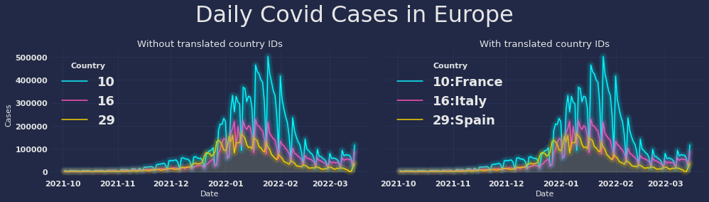

ID Translation
==============

Turn meaningless IDs into human-readable labels.

   Total number of `Covid cases`_ cases per day. IDs have been translated using the standard **id:name**-format.

.. note::
    The recommended way of creating and configuring fetchers is the :meth:`Translator.from_config()
    <rics.translation.Translator.from_config>` method. For details, see the :doc:`translation-config-format` page.

=============================
Translating IDs in 30 seconds
=============================
We will assume that there is a PostgreSQL database running locally with the following two tables present::

    humans:                       animals:
       id | name    | Gender        bestie_id | name   | is_nice
    ------+---------+--------      -----------+--------+---------
     1991 | Richard | Male                  0 | Tarzan | false
     1999 | Sofia   | Female                1 | Morris | true
                                            2 | Simba  | true

What we need:
    * A :class:`~rics.translation.fetching.SqlFetcher` to fetch from the tables above.
    * A :class:`~rics.mapping.Mapper` to bind names (such as `human_id` to table `humans`) automatically for translating
      and to map columns in the database.
    * An :class:`~rics.utility.collections.inherited_keys_dict.InheritedKeysDict` since the `animals` table has a strange ID column.

Putting it all together:

>>> fetcher = SqlFetcher(
...     # Connection string may be an environment variable if
...     # prefixed by '@'. Example: @TRANSLATION_DB_CONNECTION_STRING
...     connection_string='postgresql+pg8000://pg@localhost:5432/animalia',
...     whitelist_tables=['humans', 'animals'],
...    mapper=Mapper(overrides=InheritedKeysDict(specific={'animals': {'bestie_id': 'id'}}))
... )  # doctest: +SKIP
>>> mapper = Mapper(score_function='like_database_table', overrides={"people": "humans"})
>>> translator = Translator(fetcher, fmt='{id}:{name}[, nice={is_nice}]', mapper=mapper) # doctest: +SKIP
>>> data = {'animal': [0, 2], 'people': [1991, 1999]}
>>> for key, translated_table in translator.translate(data).items():
...    print(f'Translations for {repr(key)}:')
...    for translated_id in translated_table:
...        print(f'    {repr(translated_id)}') # Doctest: +SKIP
Translations for 'animal':
    '0:Tarzan, nice=False'
    '2:Simba, nice=True'
Translations for 'people':
    '1991:Richard'
    '1999:Sofia'

**Summary**:
    * Database contains tables `humans` and `animals`. Names are "animal" and "people".
    * ``InheritedKeysDict``: The ID-column in `animals` is ``animals.bestie_id``, we expected ``id``.
    * ``Mapper``: Responsible for matching `animal` with table `animals`. The words `"people"` and `"humans"` are too
      different for :meth:`~rics.mapping.score_functions.like_database_table`, so we provide this binding.
    * The translator ties it all together when we call :meth:`~rics.translation.Translator.translate`.
    * There is no ``humans.is_nice`` column; ``nice=<True/False>`` is present only for animals.

The example above could be solved using config options that :meth:`Translator.from_config()
<rics.translation.Translator.from_config>` provides. The primary use case for importing and using these classes directly
is writing a more advanced a ``score_function`` or fetcher than the implementations of this package provide.
