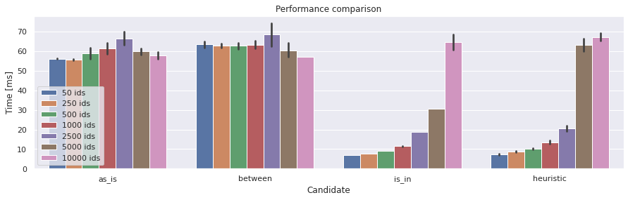

There are many support functions contain in the rics package. A few of them are presented below.

For all available methods, see the complete API reference: :mod:`rics.utility`.

=====================
Logging configuration
=====================
Set up Python logging with sane defaults and an informative logging format.

.. automethod:: rics.utility.logs.basic_config
   :noindex:

================================
Multivariate performance testing
================================
Run performance tests with multiple candidates data collections. Outputs a figure and a :class:`pandas.DataFrame` of
long-format raw data. For an example, see the `Select IN vs BETWEEN`_ notebook.

   A performance summary figure.

.. automethod:: rics.utility.perf.run_multivariate_test
   :noindex:

.. warning::
    By default, this function reports averages of all runs (repetitions), as opposed to the built-in :py:mod:`timeit`
    module which reports only the best result (in non-verbose mode).

=================================
Fetching data from remote sources
=================================
Get data from a remote source, then cache it locally. Supports postprocessing as well in which case both raw and
postprocessed data is stored.

.. automethod:: rics.utility.misc.get_local_or_remote
   :noindex:

.. warning::

    This function is meant for manual work. There is no automatic handling of failures of any kind.

========
Examples
========

----------------------------------------------
Specifying a different log level for a package
----------------------------------------------

Set a different log level for `rics`.

>>> from rics.utility.logs import basic_config, logging
>>> root_logger = logging.getLogger()
>>> basic_config(level=logging.INFO, rics_log_level=logging.DEBUG)
>>> logging.getLogger("rics").debug("I'm a debug message!")
>>> root_logger.debug("I'm a debug message!")
>>> root_logger.critical("I'm a critical message!") # Doctest: +SKIP
2022-02-05T11:17:05.378 [rics:DEBUG] I'm a debug message!
2022-02-05T11:17:05.378 [root:CRITICAL] I'm a critical message!

If `rics_log_level` is not given, the root logger log level is inherited as expected.

>>> basic_config(level=logging.INFO)  # doctest: +SKIP
>>> logging.getLogger("rics").debug("I'm a debug message!")
>>> logging.getLogger("rics").debug("I'm a critical message!")  # doctest: +SKIP
2022-02-05T11:17:05.379 [rics:CRITICAL] I'm a critical message!

Specifying different log levels for other namespaces is done in the same way. Underscores may be used instead of
dots when specifying the module path.

>>> basic_config(
...     level=logging.CRITICAL,
...     rics_log_level=logging.INFO,
...     rics_submodule_log_level=logging.DEBUG,
...     lib_module_log_level=logging.WARNING,
... )
>>> logging.getLogger().warning("I'm a warning message!")
>>> logging.getLogger("rics").debug("I'm a debug message!")
>>> logging.getLogger("rics.submodule").debug("I'm a debug message!")
>>> logging.getLogger("lib.module").debug("I'm a debug message!")
>>> logging.getLogger("lib.module").warning("I'm a warning message!") # doctest: +SKIP
2022-02-05T11:17:05.379 [rics.submodule:DEBUG] I'm a debug message!
2022-02-05T11:17:05.379 [lib.module:WARNING] I'm a warning message!

The `logging`-module exposed is just the regular Python logging library.

-----------------------------------------
Downloading data from the `IMDb dataset`_
-----------------------------------------

>>> from rics.utility.misc import get_local_or_remote
>>> import pandas as pd
>>>
>>> file = "name.basics.tsv.gz"
>>> local_root = "my-data"
>>> remote_root = "https://datasets.imdbws.com"
>>> path = get_local_or_remote(file, local_root, remote_root, show_progress=True) # doctest: +SKIP
>>> pd.read_csv(path, sep="\t").shape # doctest: +SKIP
https://datasets.imdbws.com/name.basics.tsv.gz: 100%|██████████| 214M/214M [00:05<00:00, 39.3MiB/s]
(11453719, 6)

We have download `name.basics.tsv.gz` the first time, but ``get_local_or_remote`` returns immediately the second
time it is called. A refetch can be forced using ``force_remote=True``.

>>> path = get_local_or_remote(file, local_root, remote_root, show_progress=True) # doctest: +SKIP
>>> pd.read_csv(path, sep="\t").shape # doctest: +SKIP
(11453719, 6)

.. _IMDb dataset:
    https://www.imdb.com/interfaces/

.. _Select IN vs BETWEEN:
    https://github.com/rsundqvist/rics/blob/master/jupyterlab/perf-test/sql/In-vs-Between.ipynb
